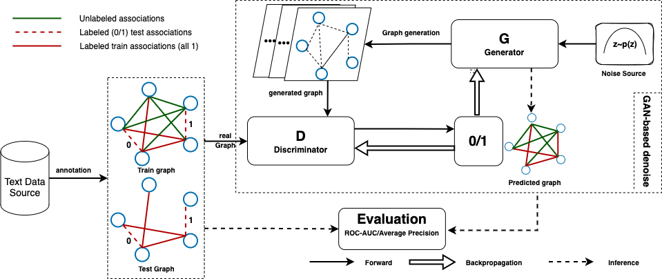
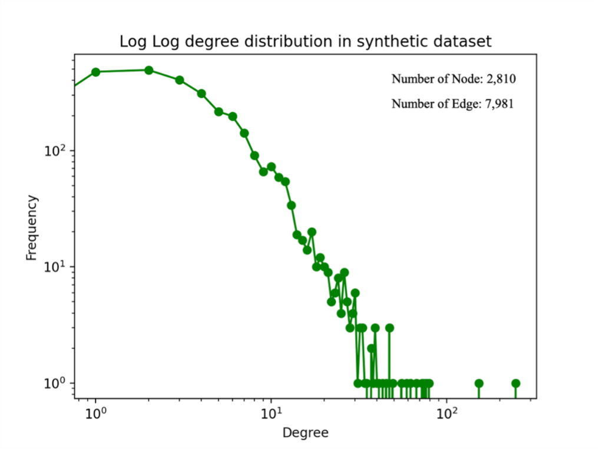
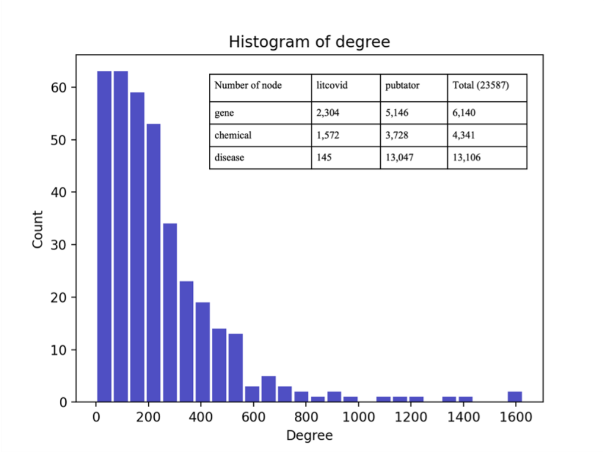
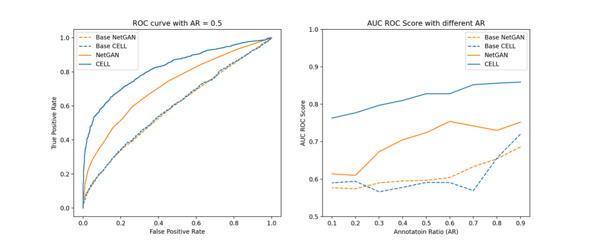
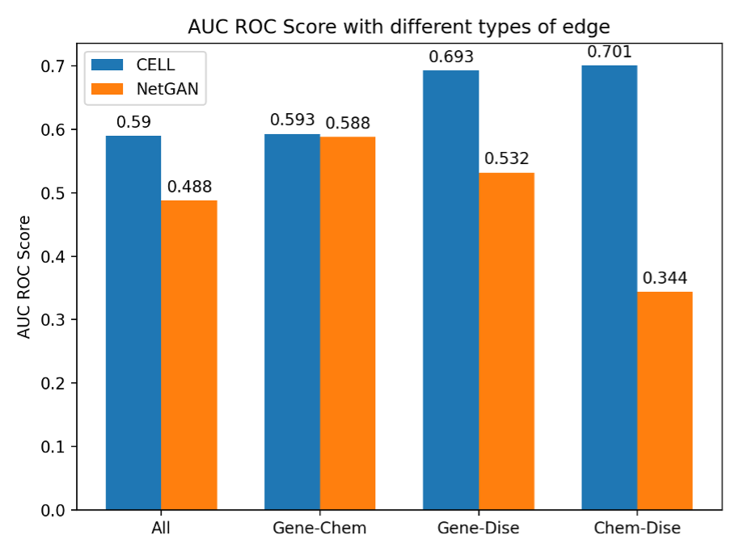

# Deep Denoising of Raw Biomedical Knowledge Graph from COVID-19 Literature, LitCovid and Pubtator


# Objective:
Most knowledge graphs, including COVID-19-related, are currently constructed based upon the co-occurring biomedical entities of recent literature. However, the applications (e.g., prediction of associations amongst genes, drugs, and diseases related to COVID-19) based on these graphs has a high probability of false-positive predictions because the co-occurrence in literature does not always mean true biomedical association amongst the two entities. The quality of data plays an important role in training deep neural network models, while most of the current work in this area is focused on improving the model’s performance assuming the data used are pre-processed clean data. Here, we studied how to remove noise from raw knowledge graphs with limited labeled information.
# Data:
+ Synthetic Dataset
  
  The synthetic dataset was formed based on CORA-ML with the same preprocessing work as NetGAN; chose the largest connected component (LCC) in the graph. The final total number of nodes and edges can be found below. We took as ground truth—the existing edges as true associations, and the nonexistence edges as false associations—to test our proposed methods
  
+ Real Dataset

  From [CORD-19-on-FHIR](https://github.com/fhircat/CORD-19-on-FHIR) [a linked data version of the COVID-19 Open Research Dataset (CORD-19) data represented in FHIR RDF by mining the CORD-19 dataset and adding semantic annotations], we utilized two annotated networks (Litcovid, Pubtator), extracting the covid-19 related terms in our SPARQL query with three types of annotation (i.e., Gene, Chemical, Mutation/Disease). After merging identical IDs from both Litcovid and Pubtator, we were able to obtain a new real dataset with a total node number of 23578. Node details of our dataset can be found in below. Finally, we randomly chose a proportional number of edges with a total of 500 associations from the whole graph with 288270 edges and manually labeled them as our labeled dataset
  
# Result
In this study, we developed a computational framework that enables the generation of a denoised knowledge graph based on a Generative Adversarial Network. Two datasets, synthetic dataset and real dataset generated from LitCovid and Pubtator, were tested with only 10% labeled information. We achieved promising results in the two tests (AUCROC > 0.8 for synthetic and 0.7 for real dataset).
+ Synthetic Dataset
 
+ Real Dataset
    
# How to Use
## Data extract and preprocessing
```angular2html
./datasets/ (These are the data and preprocessing steps)
```
1. sparql-scripts for extracting real raw data
2. ```preprocessing.py``` for building the network form the raw real data
3. ```adj_matrix.pkl.zip``` zipped adjacency matrix of real data
4. ```datasetSplit.py``` for splitting the synthetic data as training and testing with different annotation ratio
* Note: Please unzip the ```adj_matrix.pkl.zip``` before using
## Methods
```angular2html
./methods/ (Adapted NetGAN and CELL methods)
```
- NetGAN
    * Adapted from Origin repository: https://github.com/danielzuegner/netgan
    * Requirements
        ```pip install -r requirements.txt```
    * Run the code ```python testRun_task[1,2,3,4].py```
- CELL
* Adapted from origin repository: https://github.com/hheidrich/CELL
* Requirements ```pip install -r requirements.txt```
* Run the code 
```
python main[1,2,3].py
python evl_noise_ratio.py
```
## Result Visulization
```angular2html
./result/ (Raw data of result and corresponding visulization code)
```
Cytoscape (https://cytoscape.org/) 

# Contact
For help or questions of using the application, please contact Zong.nansu@mayo.edu

